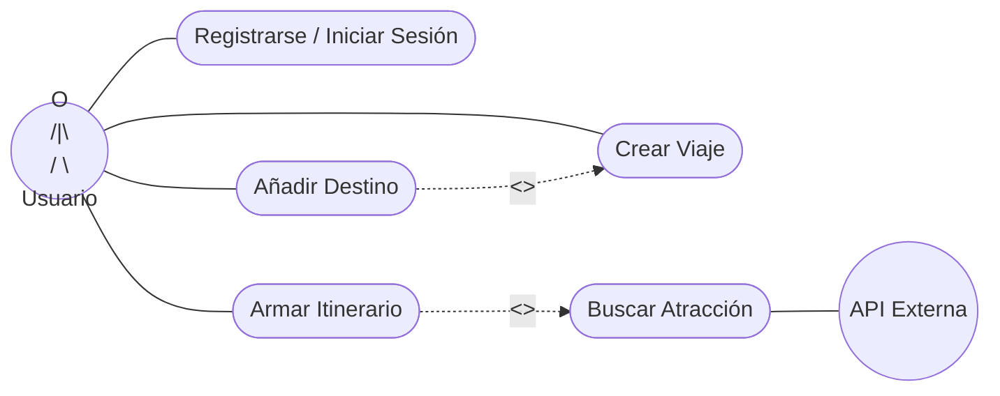
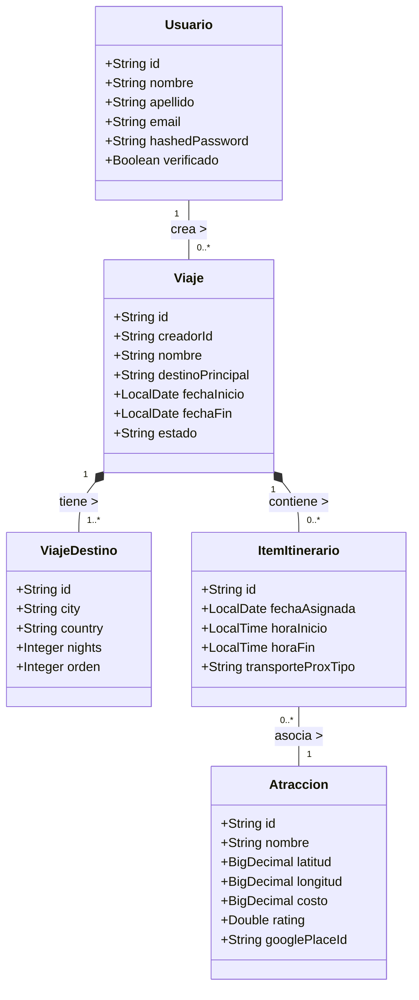

# Entrega Final - Proyecto Itera

**Materia / Curso:** [Nombre de la materia]
**Alumno/Grupo:** [Tu Nombre / Nombre del Grupo]
**Link al Repositorio de GitHub:** [https://github.com/tu-usuario/itera](https://github.com/tu-usuario/itera)

---

## 1. Estrategia de Ramas Definida

El proyecto utiliza una estrategia basada en **GitFlow** adaptado:
*   `main`: Rama principal protegida. Contiene únicamente código estable y testeado, listo para producción. Se bloquean los push directos; todo cambio ingresa mediante Pull Request (PR) aprobados y revisados.
*   `develop`: Rama de integración. Aquí convergen las nuevas funcionalidades en desarrollo.
*   `feature/*`: Ramas efímeras creadas desde `develop` para desarrollar nuevas características (ej. `feature/login`, `feature/crear-viaje`). Al finalizar, se hace merge a `develop`.
*   `hotfix/*`: Para correcciones de errores urgentes en producción.

---

## 2. Entorno Configurado e Instalación

### Requisitos Previos (SDK y Versiones Especificadas)
*   **Java SDK:** Versión 17 o superior.
*   **Go:** Versión 1.21 o superior (para servicios adicionales).
*   **Base de Datos:** MySQL 8.x.
*   **Node.js:** Versión 18.x o superior (para el frontend).
*   **Maven:** Versión 3.8.x o superior.

### Captura / Descripción de Instalación Exitosa
*El sistema se ha instalado y ejecutado exitosamente en los entornos de prueba, validando el correcto funcionamiento del frontend conectado a la API de Spring Boot y la persistencia en MySQL en todos los equipos del grupo.*

**Pasos de ejecución:**
1. Configurar base de datos `itera_db` en MySQL.
2. Levantar el backend con `mvn spring-boot:run` en la carpeta `backend-java`.
3. Levantar el frontend localmente abriendo `index.html` o con un live server.

*(Nota: En el archivo PDF final puedes adjuntar una captura de pantalla del sistema corriendo)*

---

## 3. Diagramas de Casos de Uso

**Actores Identificados:**
1.  **Usuario Registrado:** Persona que utiliza la plataforma para planificar viajes.
2.  **Sistema (API Externa):** Actor que provee datos e imágenes de atracciones (ej. Google Places API).

**Casos de Uso Principales (Mínimo 5):**
1.  **Registrarse / Iniciar Sesión:** El usuario crea una cuenta y accede al sistema.
2.  **Crear Viaje:** El usuario genera un nuevo viaje con fecha de inicio, fin y destino principal.
3.  **Añadir Destino al Viaje:** El usuario agrega múltiples ciudades al viaje creado. *(<<extend>> desde Crear Viaje)*
4.  **Armar Itinerario:** El usuario asigna atracciones a días y horarios específicos. *(<<include>> Buscar Atracción)*
5.  **Buscar Atracción:** El sistema consulta la base de datos o la API externa para obtener lugares turísticos.

---

## 4. Diagrama de Clases

**Mínimo 5 clases del dominio:**
A continuación se modelan 5 clases principales correspondientes al dominio del sistema (`Usuario`, `Viaje`, `ViajeDestino`, `ItemItinerario`, `Atraccion`), detallando atributos tipados, relaciones y multiplicidad.

---

## 5. Justificación del Stack Tecnológico

La elección de **Java con Spring Boot** para el backend se fundamenta en su robustez, seguridad y escalabilidad, características esenciales para un sistema de planificación de viajes que maneja relaciones complejas (itinerarios, múltiples destinos, atracciones) y requiere alta disponibilidad. Spring Data JPA facilita el mapeo objeto-relacional con **MySQL**, una base de datos relacional elegida por la estructura altamente interconectada del dominio del problema (`Usuarios -> Viajes -> Destinos -> Itinerarios`), garantizando la integridad referencial y las transacciones seguras (ACID). Para el frontend, el uso de **JavaScript** permite un control total sobre el DOM y una rápida iteración para consumir las APIs RESTful del backend de forma eficiente, brindando una experiencia de usuario interactiva y fluida al armar visualmente los itinerarios.
