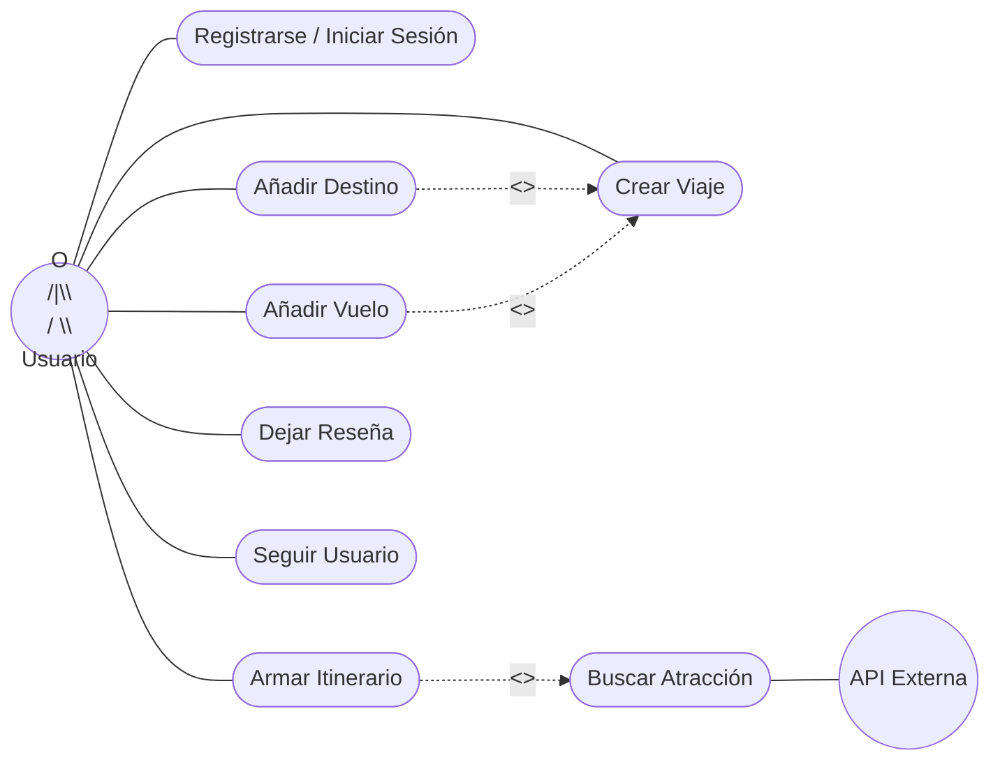
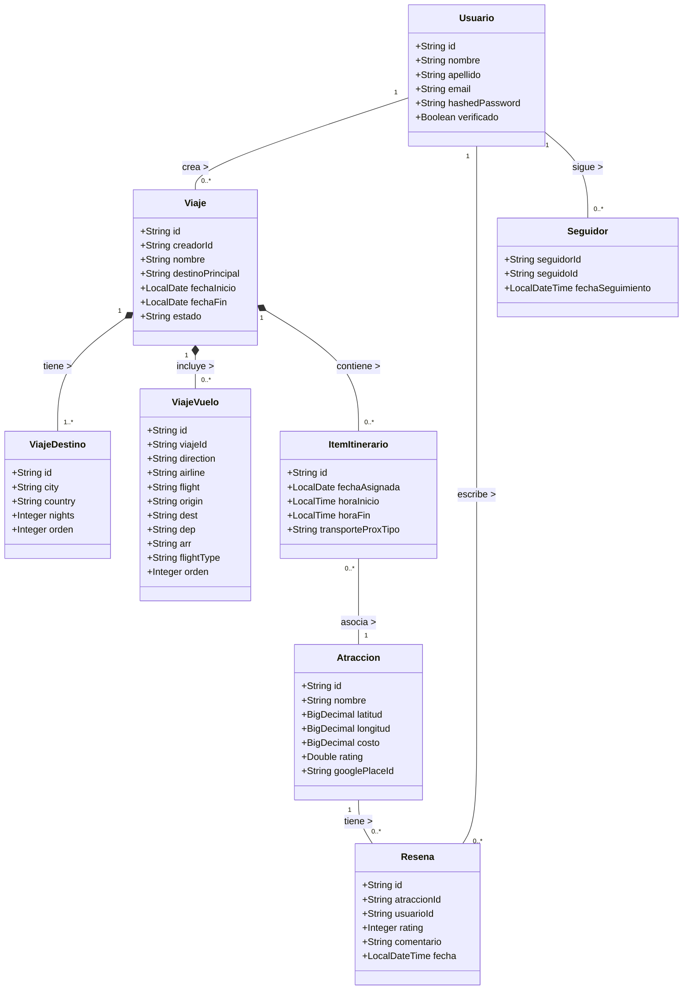

# Itera - Plataforma de Planificación de Viajes ✈️

Itera es una plataforma integral diseñada para facilitar la planificación, gestión y organización de viajes, permitiendo a los usuarios crear itinerarios detallados, gestionar destinos y organizar atracciones turísticas.

---

## 📋 Índice

1. [Requisitos Previos](#-requisitos-previos)
2. [Instalación Paso a Paso](#-instalación-paso-a-paso)
   - [Paso 1: Clonar el Repositorio](#paso-1-clonar-el-repositorio)
   - [Paso 2: Instalar MySQL (XAMPP)](#paso-2-instalar-mysql-xampp)
   - [Paso 3: Crear la Base de Datos](#paso-3-crear-la-base-de-datos)
   - [Paso 4: Configurar las API Keys](#paso-4-configurar-las-api-keys)
   - [Paso 5: Compilar y Ejecutar el Backend](#paso-5-compilar-y-ejecutar-el-backend)
   - [Paso 6: Acceder a la Aplicación](#paso-6-acceder-a-la-aplicación)
3. [Estructura del Proyecto](#-estructura-del-proyecto)
4. [Solución de Problemas](#-solución-de-problemas)
5. [Diagrama de Casos de Uso](#diagrama-de-casos-de-uso)
6. [Diagrama de Clases](#diagrama-de-clases)
7. [Stack Tecnológico](#stack-tecnologico)
8. [Estrategia de Ramas](#estrategia-de-ramas)

---

## 🔧 Requisitos Previos

Antes de comenzar, asegúrate de tener instalados los siguientes programas en tu computadora:

| Software | Versión Mínima | ¿Para qué se usa? | Enlace de Descarga |
|---|---|---|---|
| **Java JDK** | 21 | Ejecutar el backend (Spring Boot) | [Descargar JDK 21](https://www.oracle.com/java/technologies/javase/jdk21-archive-downloads.html) |
| **XAMPP** | 8.x | Provee MySQL/MariaDB como base de datos | [Descargar XAMPP](https://www.apachefriends.org/es/download.html) |
| **Git** | Cualquiera | Clonar el repositorio del proyecto | [Descargar Git](https://git-scm.com/downloads) |

> **Nota:** Maven NO necesita instalarse por separado. El proyecto ya incluye un "Maven Wrapper" (`mvnw.cmd`) que descarga Maven automáticamente al compilar por primera vez.

### ¿Cómo verificar que ya tengo lo necesario?

Abre una terminal (CMD o PowerShell) y ejecuta los siguientes comandos:

```bash
# Verificar Java (debe mostrar versión 21 o superior)
java -version

# Verificar Git
git --version

# Verificar que MySQL está accesible (desde XAMPP)
mysql --version
```

Si algún comando no es reconocido, necesitas instalar ese programa o agregarlo al PATH del sistema.

---

## 🚀 Instalación Paso a Paso

### Paso 1: Clonar el Repositorio

Abre una terminal en la carpeta donde deseas guardar el proyecto y ejecuta:

```bash
git clone https://github.com/UCH-LDS-2026/grupo-10.git
```

Luego entra a la carpeta del proyecto:

```bash
cd grupo-10
```

> **Alternativa sin Git:** Si no tienes Git instalado, puedes descargar el proyecto como archivo ZIP desde GitHub y descomprimirlo en tu escritorio.

---

### Paso 2: Instalar MySQL (XAMPP)

1. **Descarga e instala** [XAMPP](https://www.apachefriends.org/es/download.html) (versión 8.x).
2. **Abre el Panel de Control de XAMPP** (buscar "XAMPP Control Panel" en el menú Inicio).
3. **Inicia el servicio MySQL** haciendo clic en el botón **"Start"** al lado de "MySQL".

   

4. Verifica que el puerto sea **3306** (el predeterminado). Si el puerto está ocupado, revisa la sección de [Solución de Problemas](#-solución-de-problemas).

> **Importante:** Cada vez que quieras usar Itera, debes iniciar MySQL desde XAMPP primero.

---

### Paso 3: Crear la Base de Datos

Tienes **dos opciones** para crear la base de datos `itera_mvp`:

#### Opción A: Script Automático (Recomendado) ✅

1. Abre la carpeta del proyecto en el Explorador de Archivos.
2. Haz **doble clic** en el archivo `instalar_base_datos.bat`.
3. Cuando te pregunte el usuario de MySQL, presiona **Enter** para usar `root` (el predeterminado de XAMPP).
4. Cuando te pida la contraseña, presiona **Enter** directamente (XAMPP viene sin contraseña por defecto).
5. Espera a que se muestre el mensaje de **[EXITO]**.

> **¿Qué hace este script?** Ejecuta automáticamente `CREATE DATABASE IF NOT EXISTS itera_mvp` (es decir, verifica si la base de datos ya existe antes de crearla) y luego importa toda la estructura de las tablas desde `esquema_completo.sql`.

#### Opción B: Manual (phpMyAdmin)

1. Abre tu navegador y entra a: `http://localhost/phpmyadmin`
2. Haz clic en **"Nueva"** (panel izquierdo) o **"New"**.
3. En el campo "Nombre de la base de datos" escribe: `itera_mvp`
4. Selecciona el cotejamiento: `utf8mb4_unicode_ci`
5. Haz clic en **"Crear"**.
6. Selecciona la base `itera_mvp` en el panel izquierdo.
7. Ve a la pestaña **"Importar"**.
8. Haz clic en **"Seleccionar archivo"** y elige `esquema_completo.sql` desde la carpeta del proyecto.
9. Haz clic en **"Continuar"** / **"Go"**.

#### Opción C: Manual (Línea de comandos)

```bash
# Abrir la terminal de MySQL
mysql -u root -p

# Dentro de MySQL, ejecutar:
CREATE DATABASE IF NOT EXISTS itera_mvp CHARACTER SET utf8mb4 COLLATE utf8mb4_unicode_ci;
EXIT;

# Importar el esquema (desde la carpeta raíz del proyecto)
mysql -u root -p itera_mvp < esquema_completo.sql
```

---

### Paso 4: Configurar las API Keys

El proyecto utiliza la API de Google Places y Google Translation para obtener datos de atracciones turísticas y traducción de contenidos. Las claves se configuran en un archivo `.env`.

1. Navega a la carpeta `backend-java/`.
2. Abre (o crea si no existe) el archivo llamado **`.env`** con cualquier editor de texto.
3. Asegúrate de que contenga las siguientes líneas:

```env
GOOGLE_PLACES_API_KEY=TU_CLAVE_DE_GOOGLE_PLACES_AQUI
GOOGLE_TRANSLATION_API_KEY=TU_CLAVE_DE_GOOGLE_TRANSLATE_AQUI
```

> **¿No tienes API Keys?** Si estás trabajando en el equipo del proyecto, solicita las claves a un compañero o al líder del equipo. Si el archivo `.env` ya viene incluido con las claves, no necesitas modificar nada.

---

### Paso 5: Compilar y Ejecutar el Backend

1. Abre una terminal (CMD o PowerShell).
2. Navega hasta la carpeta del backend:

```bash
cd "ruta\del\proyecto\backend-java"
```

3. Ejecuta el proyecto con el Maven Wrapper incluido:

**Windows (CMD):**
```bash
mvnw.cmd spring-boot:run
```

**Windows (PowerShell):**
```powershell
.\mvnw.cmd spring-boot:run
```

4. Espera a que aparezca un mensaje similar a:

```
[OK] GOOGLE_PLACES_API_KEY cargada desde: ...
Started IteraApplication in X.XXX seconds
```

> **Primera ejecución:** La primera vez tardará más porque Maven descargará todas las dependencias automáticamente (~100-200 MB). Las siguientes ejecuciones serán mucho más rápidas.

---

### Paso 6: Acceder a la Aplicación

Una vez que el backend esté corriendo, abre tu navegador y entra a:

```
http://localhost:8000
```

Esto te llevará automáticamente a la página de inicio de sesión. Desde ahí puedes:
- **Crear una cuenta nueva** (Registro).
- **Iniciar sesión** con una cuenta existente.
- Una vez logueado, podrás acceder al **Home**, crear viajes, explorar destinos, armar itinerarios, y más.

> **El backend sirve el frontend automáticamente.** No necesitas ningún servidor adicional ni abrir archivos HTML manualmente. Spring Boot se encarga de servir todas las páginas del frontend desde el puerto `8000`.

---

## 📁 Estructura del Proyecto

```
📂 Proyecto final/
├── 📂 backend-java/                    # Servidor backend (API REST)
│   ├── 📄 .env                         # Claves de API (Google Places, Translation)
│   ├── 📄 pom.xml                      # Dependencias Maven (Spring Boot, MySQL, etc.)
│   ├── 📄 mvnw.cmd                     # Maven Wrapper (no requiere instalar Maven)
│   └── 📂 src/
│       └── 📂 main/
│           ├── 📂 java/com/itera/      # Código fuente Java
│           │   ├── 📄 IteraApplication.java      # Punto de entrada principal
│           │   ├── 📄 DatabaseInitializer.java   # Inicializador de BD
│           │   └── 📂 ... (controllers, models, services)
│           └── 📂 resources/
│               ├── 📄 application.properties     # Configuración del servidor
│               └── 📂 db/migration/              # Migraciones SQL (Flyway)
│
├── 📂 frontend/                        # Interfaz de usuario (HTML/CSS/JS)
│   ├── 📄 index.html                   # Página raíz (redirige a auth)
│   ├── 📂 pages/                       # Todas las páginas de la app
│   │   ├── 📂 auth/                    # Registro e inicio de sesión
│   │   ├── 📂 home/                    # Página principal (post-login)
│   │   ├── 📂 create-trip/             # Crear un nuevo viaje
│   │   ├── 📂 trip-detail/             # Detalle de un viaje
│   │   ├── 📂 trip-planner/            # Planificador de itinerario
│   │   ├── 📂 destinations/            # Explorar destinos
│   │   ├── 📂 explore-catalog/         # Catálogo de exploración
│   │   ├── 📂 attractions/             # Atracciones turísticas
│   │   ├── 📂 dashboard/               # Panel de viajes del usuario
│   │   ├── 📂 profile/                 # Perfil de usuario
│   │   ├── 📂 trip-logistics/          # Logística del viaje
│   │   └── 📂 trip-route/              # Ruta del viaje
│   └── 📂 shared/                      # Recursos compartidos (CSS, imágenes, utils)
│
├── 📄 esquema_completo.sql             # Estructura completa de la base de datos
├── 📄 instalar_base_datos.bat          # Script automático para crear la BD
├── 📄 diagrama_er.md                   # Diagrama Entidad-Relación
└── 📄 README.md                        # Este archivo
```

---

## ❓ Solución de Problemas

### El backend no inicia: "Communications link failure"
**Causa:** MySQL no está iniciado.
**Solución:** Abre XAMPP y haz clic en "Start" al lado de MySQL.

### El backend no inicia: "Access denied for user 'root'"
**Causa:** La contraseña de MySQL no coincide con la configurada.
**Solución:** Edita el archivo `backend-java/src/main/resources/application.properties` y actualiza la línea:
```properties
spring.datasource.password=TU_CONTRASEÑA_DE_MYSQL
```
> En XAMPP la contraseña de root viene vacía por defecto (`spring.datasource.password=`).

### El backend no inicia: "Unknown database 'itera_mvp'"
**Causa:** La base de datos no fue creada.
**Solución:** Ejecuta el archivo `instalar_base_datos.bat` o créala manualmente (ver [Paso 3](#paso-3-crear-la-base-de-datos)).

### Error: "JAVA_HOME is not set"
**Causa:** Java no está en las variables de entorno del sistema.
**Solución:**
1. Busca "Variables de entorno" en el menú Inicio de Windows.
2. En "Variables del sistema", haz clic en "Nueva".
3. Nombre: `JAVA_HOME` / Valor: ruta de tu JDK (ej. `C:\Program Files\Java\jdk-21`).
4. Edita la variable `Path` y agrega: `%JAVA_HOME%\bin`.
5. Reinicia la terminal.

### Error: "'mysql' no se reconoce como un comando"
**Causa:** MySQL no está en el PATH del sistema.
**Solución:**
1. Busca "Variables de entorno" en Windows.
2. Edita la variable `Path` del sistema.
3. Agrega la ruta: `C:\xampp\mysql\bin` (o la ruta donde tengas XAMPP instalado).
4. Reinicia la terminal.

### El puerto 8000 ya está en uso
**Causa:** Otro programa está ocupando el puerto.
**Solución:** Cambia el puerto en `application.properties`:
```properties
server.port=8080
```
Y accede a `http://localhost:8080` en vez de `http://localhost:8000`.

### El buscador del Home no muestra sugerencias
**Causa:** Las API Keys de Google Places no están configuradas correctamente.
**Solución:** Verifica que el archivo `backend-java/.env` contenga una clave válida para `GOOGLE_PLACES_API_KEY`.

---

## 📌 Resumen Rápido (Checklist)

Para dejar el sistema 100% funcional, sigue estos pasos en orden:

- [ ] Instalar **Java JDK 21**
- [ ] Instalar **XAMPP** (para MySQL)
- [ ] Instalar **Git**
- [ ] Clonar el repositorio con `git clone`
- [ ] Iniciar **MySQL** desde el panel de XAMPP
- [ ] Ejecutar `instalar_base_datos.bat` (doble clic)
- [ ] Verificar que el archivo `backend-java/.env` tenga las API Keys
- [ ] Abrir terminal en `backend-java/` y ejecutar `mvnw.cmd spring-boot:run`
- [ ] Abrir `http://localhost:8000` en el navegador
- [ ] ¡Listo! 🎉

---
<a id="diagrama-de-casos-de-uso"></a>
## 👥 Diagrama de Casos de Uso

**Actores Identificados:**
1.  **Usuario Registrado:** Persona que utiliza la plataforma para planificar viajes.
2.  **Sistema (API Externa):** Actor que provee datos e imágenes de atracciones (ej. Google Places API).

**Casos de Uso:**
1.  **Registrarse / Iniciar Sesión:** El usuario crea una cuenta y accede al sistema.
2.  **Crear Viaje:** El usuario genera un nuevo viaje con fecha de inicio, fin y destino principal.
3.  **Añadir Destino al Viaje:** El usuario agrega múltiples ciudades al viaje creado. *(<<extend>> desde Crear Viaje)*
4.  **Armar Itinerario:** El usuario asigna atracciones a días y horarios específicos. *(<<include>> Buscar Atracción)*
5.  **Buscar Atracción:** El sistema consulta la base de datos o la API externa para obtener lugares turísticos.
6.  **Añadir Vuelo:** El usuario agrega detalles de vuelos a su viaje. *(<<extend>> desde Crear Viaje)*
7.  **Dejar Reseña:** El usuario califica y comenta una atracción visitada.
8.  **Seguir Usuario:** El usuario sigue a otros usuarios en la plataforma.



<a id="diagrama-de-clases"></a>
## 🏗️ Diagrama de Clases

**Mínimo 5 clases del dominio:**



<a id="stack-tecnologico"></a>
## 🛠️ Justificación del Stack Tecnológico

| Capa | Tecnología | Justificación |
|---|---|---|
| **Backend** | Java 21 + Spring Boot 3.2 | Robustez, seguridad y escalabilidad. Spring Data JPA facilita el ORM con MySQL. |
| **Base de Datos** | MySQL (MariaDB/XAMPP) | Estructura altamente relacional del dominio. Integridad referencial y transacciones ACID. |
| **Migraciones** | Flyway | Gestión versionada y automática del esquema de BD. |
| **Frontend** | HTML + CSS + JavaScript | Control total del DOM, rápida iteración, consume APIs RESTful del backend. |
| **API Externa** | Google Places API | Provee datos de atracciones, fotos e información turística en tiempo real. |
| **Build Tool** | Maven (con Wrapper) | Gestión de dependencias estándar en el ecosistema Java. No requiere instalación. |

<a id="estrategia-de-ramas">
## 🌿 Estrategia de Ramas

El proyecto utiliza **GitFlow** adaptado:
*   `main`: Rama principal protegida. Contiene únicamente código estable y testeado, listo para producción. Se bloquean los push directos; todo cambio ingresa mediante Pull Request (PR) aprobados y revisados.
*   `develop`: Rama de integración. Aquí convergen las nuevas funcionalidades en desarrollo.
*   `feature/*`: Ramas efímeras creadas desde `develop` para desarrollar nuevas características (ej. `feature/login`, `feature/crear-viaje`). Al finalizar, se hace merge a `develop`.
*   `hotfix/*`: Para correcciones de errores urgentes en producción.
