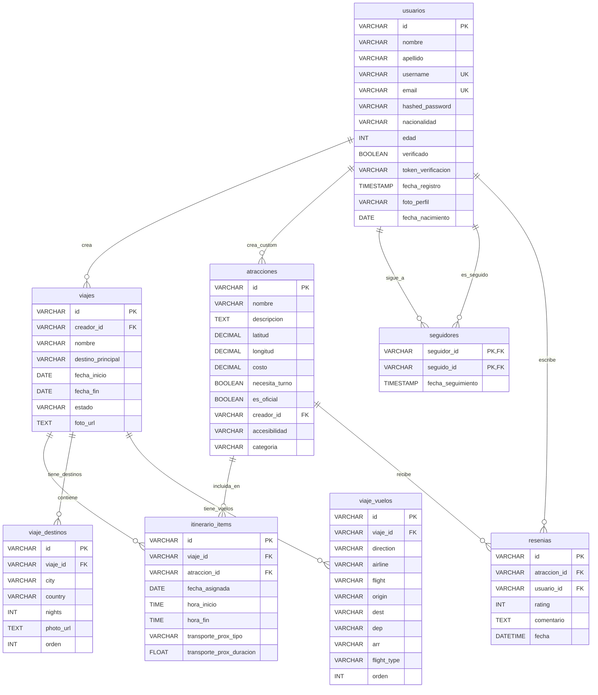

```mermaid
erDiagram
    usuarios {
        VARCHAR id PK
        VARCHAR nombre
        VARCHAR apellido
        VARCHAR username UK
        VARCHAR email UK
        VARCHAR hashed_password
        VARCHAR nacionalidad
        INT edad
        BOOLEAN verificado
        VARCHAR token_verificacion
        TIMESTAMP fecha_registro
        VARCHAR foto_perfil
        DATE fecha_nacimiento
    }

    viajes {
        VARCHAR id PK
        VARCHAR creador_id FK
        VARCHAR nombre
        VARCHAR destino_principal
        DATE fecha_inicio
        DATE fecha_fin
        VARCHAR estado
        TEXT foto_url
    }

    atracciones {
        VARCHAR id PK
        VARCHAR nombre
        TEXT descripcion
        DECIMAL latitud
        DECIMAL longitud
        DECIMAL costo
        BOOLEAN necesita_turno
        BOOLEAN es_oficial
        VARCHAR creador_id FK
        VARCHAR accesibilidad
        VARCHAR categoria
    }

    itinerario_items {
        VARCHAR id PK
        VARCHAR viaje_id FK
        VARCHAR atraccion_id FK
        DATE fecha_asignada
        TIME hora_inicio
        TIME hora_fin
        VARCHAR transporte_prox_tipo
        FLOAT transporte_prox_duracion
    }

    viaje_destinos {
        VARCHAR id PK
        VARCHAR viaje_id FK
        VARCHAR city
        VARCHAR country
        INT nights
        TEXT photo_url
        INT orden
    }

    viaje_vuelos {
        VARCHAR id PK
        VARCHAR viaje_id FK
        VARCHAR direction
        VARCHAR airline
        VARCHAR flight
        VARCHAR origin
        VARCHAR dest
        VARCHAR dep
        VARCHAR arr
        VARCHAR flight_type
        INT orden
    }

    seguidores {
        VARCHAR seguidor_id PK,FK
        VARCHAR seguido_id PK,FK
        TIMESTAMP fecha_seguimiento
    }

    resenias {
        VARCHAR id PK
        VARCHAR atraccion_id FK
        VARCHAR usuario_id FK
        INT rating
        TEXT comentario
        DATETIME fecha
    }

    %% Relaciones
    usuarios ||--o{ viajes : "crea"
    usuarios ||--o{ atracciones : "crea_custom"
    viajes ||--o{ itinerario_items : "contiene"
    atracciones ||--o{ itinerario_items : "incluida_en"
    viajes ||--o{ viaje_destinos : "tiene_destinos"
    viajes ||--o{ viaje_vuelos : "tiene_vuelos"
    usuarios ||--o{ seguidores : "sigue_a"
    usuarios ||--o{ seguidores : "es_seguido"
    usuarios ||--o{ resenias : "escribe"
    atracciones ||--o{ resenias : "recibe"
```
