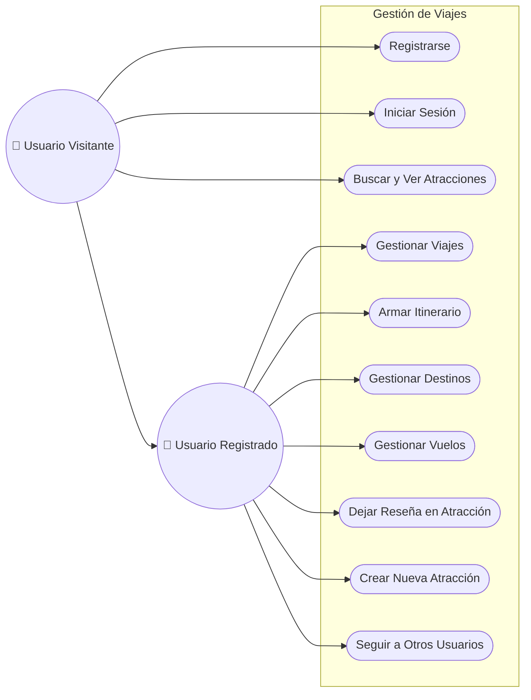

# Diagrama de Casos de Uso

Este diagrama representa los principales casos de uso del sistema para los actores involucrados.

```mermaid
flowchart LR
    %% Actores
    Visitante(("👤 Usuario Visitante"))
    Registrado(("👤 Usuario Registrado"))

    Visitante --> Registrado

    %% Casos de Uso
    subgraph Sistema Itera [Gestión de Viajes]
        UC1([Registrarse])
        UC2([Iniciar Sesión])
        UC3([Buscar y Ver Atracciones])
        
        UC4([Gestionar Viajes])
        UC5([Armar Itinerario])
        UC6([Gestionar Destinos])
        UC7([Gestionar Vuelos])
        UC8([Dejar Reseña en Atracción])
        UC9([Crear Nueva Atracción])
        UC10([Seguir a Otros Usuarios])
    end

    %% Relaciones Visitante
    Visitante --> UC1
    Visitante --> UC2
    Visitante --> UC3

    %% Relaciones Registrado
    Registrado --> UC4
    Registrado --> UC5
    Registrado --> UC6
    Registrado --> UC7
    Registrado --> UC8
    Registrado --> UC9
    Registrado --> UC10
```
