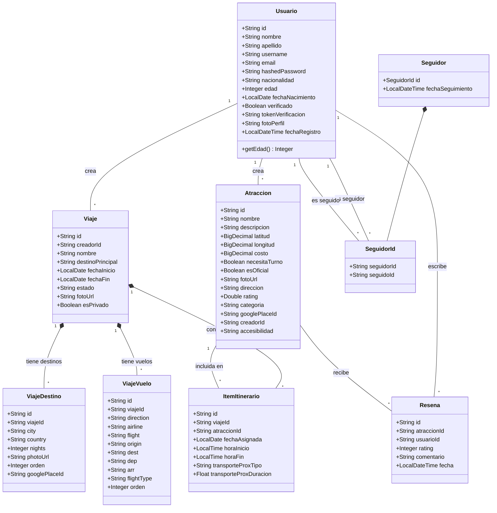

# Diagrama de Clases

Este diagrama representa las entidades principales del sistema y sus relaciones.

```mermaid
classDiagram
    class Usuario {
        +String id
        +String nombre
        +String apellido
        +String username
        +String email
        +String hashedPassword
        +String nacionalidad
        +Integer edad
        +LocalDate fechaNacimiento
        +Boolean verificado
        +String tokenVerificacion
        +String fotoPerfil
        +LocalDateTime fechaRegistro
        +getEdad() Integer
    }

    class Viaje {
        +String id
        +String creadorId
        +String nombre
        +String destinoPrincipal
        +LocalDate fechaInicio
        +LocalDate fechaFin
        +String estado
        +String fotoUrl
        +Boolean esPrivado
    }

    class ViajeDestino {
        +String id
        +String viajeId
        +String city
        +String country
        +Integer nights
        +String photoUrl
        +Integer orden
        +String googlePlaceId
    }

    class ViajeVuelo {
        +String id
        +String viajeId
        +String direction
        +String airline
        +String flight
        +String origin
        +String dest
        +String dep
        +String arr
        +String flightType
        +Integer orden
    }

    class Atraccion {
        +String id
        +String nombre
        +String descripcion
        +BigDecimal latitud
        +BigDecimal longitud
        +BigDecimal costo
        +Boolean necesitaTurno
        +Boolean esOficial
        +String fotoUrl
        +String direccion
        +Double rating
        +String categoria
        +String googlePlaceId
        +String creadorId
        +String accesibilidad
    }

    class ItemItinerario {
        +String id
        +String viajeId
        +String atraccionId
        +LocalDate fechaAsignada
        +LocalTime horaInicio
        +LocalTime horaFin
        +String transporteProxTipo
        +Float transporteProxDuracion
    }

    class Resena {
        +String id
        +String atraccionId
        +String usuarioId
        +Integer rating
        +String comentario
        +LocalDateTime fecha
    }

    class Seguidor {
        +SeguidorId id
        +LocalDateTime fechaSeguimiento
    }
    
    class SeguidorId {
        +String seguidorId
        +String seguidoId
    }

    %% Relaciones
    Usuario "1" -- "*" Viaje : crea
    Usuario "1" -- "*" Atraccion : crea
    Usuario "1" -- "*" Resena : escribe
    
    Seguidor *-- SeguidorId
    Usuario "1" -- "*" SeguidorId : es seguidor
    Usuario "1" -- "*" SeguidorId : es seguido
    
    Viaje "1" *-- "*" ViajeDestino : tiene destinos
    Viaje "1" *-- "*" ViajeVuelo : tiene vuelos
    Viaje "1" *-- "*" ItemItinerario : contiene items
    
    Atraccion "1" -- "*" ItemItinerario : incluida en
    Atraccion "1" -- "*" Resena : recibe
```
